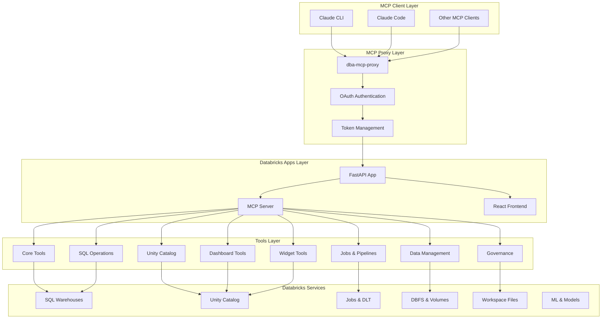
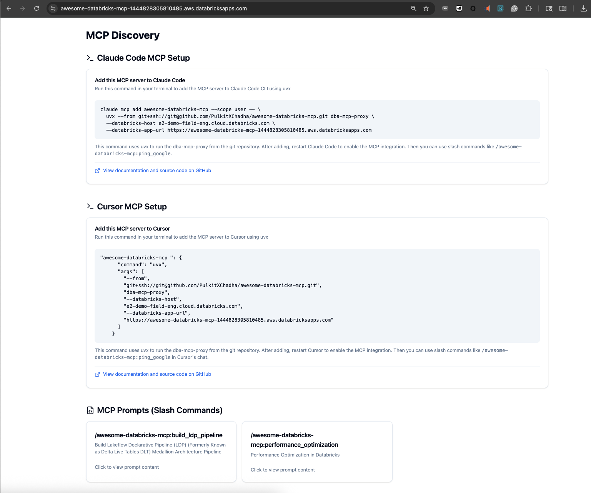
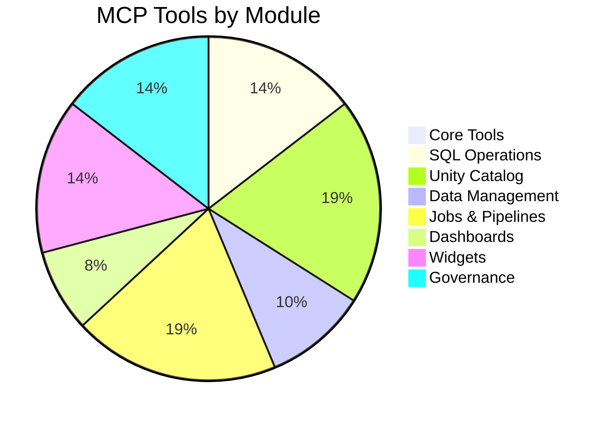
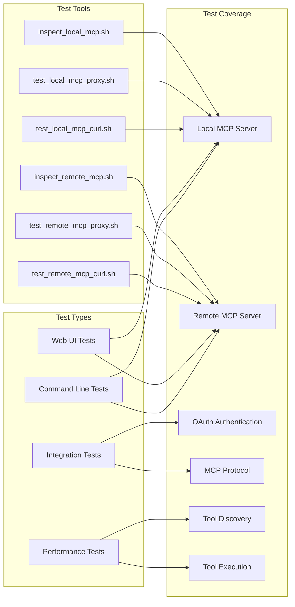
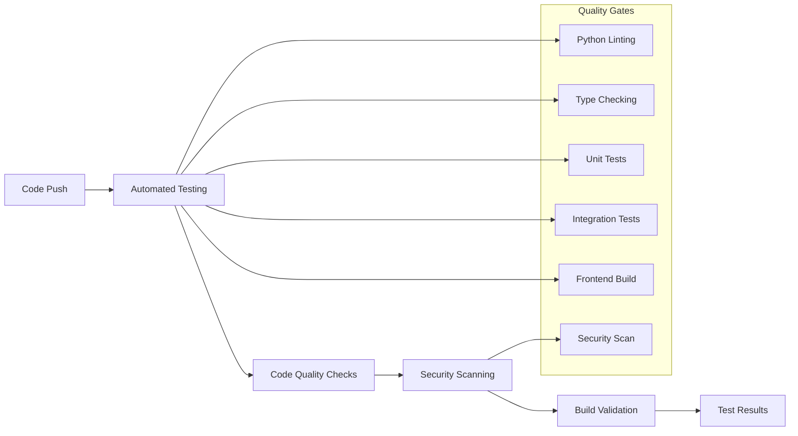

# awesome-databricks-mcp

Host Model Context Protocol (MCP) prompts and tools on Databricks Apps, enabling AI assistants like Claude to interact with your Databricks workspace through a secure, authenticated interface.

## What is this?

This template lets you create an MCP server that runs on Databricks Apps. You can:
- 📝 **Add prompts** as simple markdown files in the `prompts/` folder
- 🛠️ **Create tools** as Python functions that leverage Databricks SDK
- 🔐 **Authenticate securely** with OAuth through Databricks Apps
- 🚀 **Deploy instantly** to make your MCP server accessible to Claude
- 🖥️ **Web Interface** with a modern React TypeScript frontend for MCP discovery
- 🧪 **Comprehensive Testing** with automated MCP validation tools
- 🔄 **CI/CD Pipeline** with automated testing, security scanning, and deployment
- 📊 **Advanced Dashboard Tools** for building comprehensive Lakeview and legacy dashboards

Think of it as a bridge between Claude and your Databricks workspace - you define what Claude can see and do, and this server handles the rest.

## How it Works

### Architecture Overview
```
┌─────────────┐       MCP Protocol      ┌──────────────────┐        OAuth         ┌─────────────────┐
│   Claude    │ ◄─────────────────────► │  dba-mcp-proxy   │ ◄──────────────────► │ Databricks App  │
│    CLI      │     (stdio/JSON-RPC)    │ (local process)  │    (HTTPS/SSE)      │  (MCP Server)   │
└─────────────┘                         └──────────────────┘                      └─────────────────┘
                                                ▲                                           │
                                                │                                           ▼
                                                └────────── Databricks OAuth ──────► Workspace APIs
```


### Components

1. **MCP Server** (`server/app.py`): A FastAPI app with integrated MCP server that:
   - Dynamically loads prompts from `prompts/*.md` files
   - Exposes Python functions as MCP tools via modular tool system
   - Handles both HTTP requests and MCP protocol over Server-Sent Events
   - Uses FastMCP framework for seamless MCP integration

2. **React Frontend** (`client/`): A modern TypeScript React application that:
   - Provides a web interface for MCP discovery and testing
   - Shows available prompts, tools, and MCP configuration
   - Includes copy-paste setup commands for Claude integration
   - Built with TailwindCSS, Radix UI, and modern React patterns
   - Uses Vite for fast development and building

3. **Prompts** (`prompts/`): Simple markdown files where:
   - Filename = prompt name (e.g., `build_lakeview_dashboard.md` → `build_lakeview_dashboard` prompt)
   - First line with `#` = description
   - File content = what gets returned to Claude

4. **Modular Tools System** (`server/tools/`): Organized tool modules that:
   - Break down functionality into logical, manageable components
   - Provide 100+ tools across 9 specialized modules
   - Enable better maintainability and collaboration
   - Support easy addition of new tools

5. **Local Proxy** (`dba_mcp_proxy/`): Authenticates and proxies MCP requests:
   - Handles Databricks OAuth authentication automatically
   - Translates between Claude's stdio protocol and HTTP/SSE
   - Works with both local development and deployed apps

6. **Comprehensive Testing Suite** (`claude_scripts/`): Automated validation tools:
   - Local and remote MCP server testing
   - MCP protocol compliance validation
   - OAuth authentication flow testing
   - Web-based MCP Inspector for interactive testing

## 🎬 Demo

This 5-minute video shows you how to set up and use the MCP server with Claude and/or Cursor: https://www.youtube.com/watch?v=_yPtm2iH04o



## Quick Start

### Create Your Own MCP Server

#### Step 1: Install Databricks CLI and Set Up GitHub SSH Access

Before you begin, make sure you have the Databricks CLI and GitHub SSH access configured.

**Install Databricks CLI:**

**macOS:**
```bash
# Using Homebrew (recommended)
brew install databricks/tap/databricks

# Using pip
pip install databricks-cli

# Verify installation
databricks --version
```

**Windows:**
```bash
# Using pip
pip install databricks-cli

# Or download from official releases
# https://github.com/databricks/databricks-cli/releases
# Download the .exe file and add to PATH

# Verify installation
databricks --version
```

**Linux:**
```bash
# Using pip
pip install databricks-cli

# Using apt (Ubuntu/Debian)
curl -fsSL https://databricks.com/install-cli.sh | bash

# Using yum (RHEL/CentOS)
curl -fsSL https://databricks.com/install-cli.sh | bash

# Verify installation
databricks --version
```

**Set Up GitHub SSH Access:**

**macOS:**
```bash
# Generate SSH key (if you don't have one)
ssh-keygen -t ed25519 -C "your-email@example.com"

# Start ssh-agent
eval "$(ssh-agent -s)"

# Add SSH key to ssh-agent
ssh-add ~/.ssh/id_ed25519

# Copy public key to clipboard
pbcopy < ~/.ssh/id_ed25519.pub

# Add to GitHub: https://github.com/settings/keys
# Click "New SSH key" and paste the copied key
```

**Windows:**
```bash
# Generate SSH key (if you don't have one)
ssh-keygen -t ed25519 -C "your-email@example.com"

# Start ssh-agent (PowerShell as Administrator)
Set-Service ssh-agent -StartupType Automatic
Start-Service ssh-agent

# Add SSH key to ssh-agent
ssh-add ~/.ssh/id_ed25519

# Copy public key to clipboard
Get-Content ~/.ssh/id_ed25519.pub | Set-Clipboard

# Add to GitHub: https://github.com/settings/keys
# Click "New SSH key" and paste the copied key
```

**Linux:**
```bash
# Generate SSH key (if you don't have one)
ssh-keygen -t ed25519 -C "your-email@example.com"

# Start ssh-agent
eval "$(ssh-agent -s)"

# Add SSH key to ssh-agent
ssh-add ~/.ssh/id_ed25519

# Copy public key to clipboard (if xclip is available)
xclip -sel clip < ~/.ssh/id_ed25519.pub

# Or display the key to copy manually
cat ~/.ssh/id_ed25519.pub

# Add to GitHub: https://github.com/settings/keys
# Click "New SSH key" and paste the copied key
```

**Test GitHub SSH Connection:**
```bash
# Test the connection
ssh -T git@github.com

# You should see: "Hi username! You've successfully authenticated..."
```

**Configure Git with SSH:**
```bash
# Set your Git username and email
git config --global user.name "Your Name"
git config --global user.email "your-email@example.com"

# Verify SSH is working by cloning a private repo
git clone git@github.com:username/private-repo.git
```

#### Step 2: Clone the Repo

```bash
# Clone your new repository
git clone https://github.com/PulkitXChadha/awesome-databricks-mcp.git
cd awesome-databricks-mcp

# Run the interactive setup
./setup.sh
```

This will:
- Configure Databricks authentication
- Set your MCP server name
- Install all dependencies (Python + Node.js)
- Create your `.env.local` file

#### Step 3: Deploy with Claude

In Claude Code, run:
```
/setup-mcp
```

This will:
- Deploy your MCP server to Databricks Apps
- Configure the MCP integration
- Show you available prompts and tools

Then restart Claude Code to use your new MCP server.

### Add to Claude CLI

After deployment, add your MCP server to Claude:

```bash
# Set your Databricks configuration
export DATABRICKS_HOST="https://your-workspace.cloud.databricks.com"
export DATABRICKS_APP_URL="https://your-app.databricksapps.com"  # Get this from ./app_status.sh
export SERVER_NAME="your-server-name"  # This comes from config.yaml (set during ./setup.sh)

# Add your MCP server to Claude (user-scoped)
claude mcp add $SERVER_NAME --scope user -- \
  uvx --from git+https://git@github.com/YOUR-USERNAME/your-repo.git dba-mcp-proxy \
  --databricks-host $DATABRICKS_HOST \
  --databricks-app-url $DATABRICKS_APP_URL
```

### Local Development

```bash
# Clone and setup
git clone <your-repo>
cd <your-repo>
./setup.sh

# Start dev server (both backend and frontend)
./watch.sh

# Set your configuration for local testing
export DATABRICKS_HOST="https://your-workspace.cloud.databricks.com"
export DATABRICKS_APP_URL="http://localhost:8000"  # Local dev server

# Add to Claude for local testing
claude mcp add databricks-mcp-local --scope local -- \
  uvx --from git+https://git@github.com/YOUR-ORG/YOUR-REPO.git dba-mcp-proxy \
  --databricks-host $DATABRICKS_HOST \
  --databricks-app-url $DATABRICKS_APP_URL
```

## Running Locally

### Prerequisites

Before running the MCP server locally, ensure you have:

- **Python 3.11+** and **Node.js 18+** installed
- **Databricks CLI** configured with `databricks auth login`
- **Git** for cloning the repository
- **uv** package manager (recommended) or **pip** for Python dependencies
- **bun** (recommended) or **npm** for Node.js dependencies

### Step-by-Step Local Setup

#### 1. Clone and Configure

```bash
# Clone your repository
git clone https://github.com/PulkitXChadha/awesome-databricks-mcp.git
cd awesome-databricks-mcp

# Run the interactive setup script
./setup.sh
```

The setup script will:
- Install Python dependencies using `uv` or `pip`
- Install Node.js dependencies using `bun` or `npm`
- Configure your Databricks workspace settings
- Create a `.env.local` file with your configuration

#### 2. Start the Development Server

```bash
# Start both backend (FastAPI) and frontend (React) servers
./watch.sh
```

This command starts:
- **Backend**: FastAPI server on `http://localhost:8000`
- **Frontend**: React development server on `http://localhost:3000`
- **File watching**: Automatic reloading when files change

#### 3. Verify Local Setup

Open your browser and navigate to:
- **Backend API**: http://localhost:8000/docs (FastAPI Swagger UI)
- **Frontend**: http://localhost:3000 (React application)
- **MCP Endpoint**: http://localhost:8000/mcp/ (MCP server)

#### 4. Test with Claude CLI

```bash
# Set environment variables for local testing
export DATABRICKS_HOST="https://your-workspace.cloud.databricks.com"
export DATABRICKS_APP_URL="http://localhost:8000"

# Add the local MCP server to Claude
claude mcp add databricks-mcp-local --scope local -- \
  uvx --from git+https://git@github.com/PulkitXChadha/awesome-databricks-mcp.git dba-mcp-proxy \
  --databricks-host $DATABRICKS_HOST \
  --databricks-app-url $DATABRICKS_APP_URL

# Test the connection
echo "What MCP prompts are available from databricks-mcp-local?" | claude
```

### Development Workflow

#### Making Changes

1. **Edit prompts**: Modify files in `prompts/` directory
2. **Edit tools**: Update functions in appropriate modules under `server/tools/`
3. **Edit frontend**: Modify React components in `client/src/`
4. **Edit backend**: Update FastAPI routes in `server/`

All changes automatically reload thanks to the file watchers in `./watch.sh`.

#### Testing Changes

```bash
# Test local MCP server directly
./claude_scripts/test_local_mcp_curl.sh

# Test with MCP proxy
./claude_scripts/test_local_mcp_proxy.sh

# Use the web-based MCP Inspector
./claude_scripts/inspect_local_mcp.sh
```

#### Debugging

- **Backend logs**: Check terminal output from `./watch.sh`
- **Frontend logs**: Check browser console and terminal output
- **MCP logs**: Monitor the `/mcp/` endpoint responses
- **Database queries**: Check Databricks workspace logs

### Local vs Production Differences

| Feature | Local Development | Production |
|---------|------------------|------------|
| **Authentication** | Databricks CLI token | OAuth via Databricks Apps |
| **URL** | `http://localhost:8000` | `https://your-app.databricksapps.com` |
| **HTTPS** | No (HTTP only) | Yes (HTTPS required) |
| **File watching** | Yes (auto-reload) | No |
| **Debug mode** | Yes | No |
| **Logs** | Terminal output | Databricks Apps logs |

### Troubleshooting Local Issues

#### Common Problems

**Port conflicts:**
```bash
# Check what's using port 8000
lsof -i :8000

# Kill process if needed
kill -9 <PID>
```

**Dependencies not found:**
```bash
# Reinstall Python dependencies
uv sync

# Reinstall Node.js dependencies
cd client && bun install
```

**Databricks authentication:**
```bash
# Refresh Databricks CLI credentials
databricks auth login

# Verify configuration
databricks config get
```

**MCP connection issues:**
```bash
# Test MCP endpoint directly
curl http://localhost:8000/mcp/

# Check Claude MCP configuration
claude mcp list
```

#### Performance Tips

- Use `uv` instead of `pip` for faster Python dependency management
- Use `bun` instead of `npm` for faster Node.js dependency management
- The `./watch.sh` script uses `uvicorn --reload` for fast backend development
- Frontend uses Vite for fast hot module replacement

## Deployment

```bash
# Deploy to Databricks Apps
./deploy.sh

# Check status and get your app URL
./app_status.sh
```

Your MCP server will be available at `https://your-app.databricksapps.com/mcp/`

The `app_status.sh` script will show your deployed app URL, which you'll need for the `DATABRICKS_APP_URL` environment variable when adding the MCP server to Claude.

## Authentication

- **Local Development**: No authentication required
- **Production**: OAuth is handled automatically by the proxy using your Databricks CLI credentials

## Examples

### Using with Claude

Once added, you can interact with your MCP server in Claude:

```
Human: What prompts are available?

Claude: I can see the following prompts from your Databricks MCP server:
- build_lakeview_dashboard: Build comprehensive Lakeview dashboards with data validation
- build_ldp_pipeline: Build a Declarative Pipelines pipeline for data processing
```

### Sample Tool Usage

```
Human: Can you execute a SQL query to show databases?

Claude: I'll execute that SQL query for you using the execute_dbsql tool.

[Executes SQL and returns results]
```

## Project Structure

```
├── server/                    # FastAPI backend with MCP server
│   ├── app.py                # Main application + MCP server setup
│   ├── tools/                # Modular MCP tools implementation
│   │   ├── __init__.py       # Tool registration and loading
│   │   ├── core.py           # Core and health tools
│   │   ├── sql_operations.py # SQL and warehouse tools
│   │   ├── unity_catalog.py  # Unity Catalog tools
│   │   ├── data_management.py # Data and DBFS tools
│   │   ├── jobs_pipelines.py # Jobs and DLT pipeline tools
│   │   ├── dashboards.py     # Dashboard tools
│   │   ├── widgets.py        # Widget creation and management
│   │   ├── governance.py     # Governance and compliance tools
│   │   └── utils.py          # Shared utility functions
│   ├── models/               # Data models and type definitions
│   │   ├── __init__.py       # Model exports
│   │   └── widget_types.py   # Widget type definitions and constants
│   └── routers/              # API endpoints
├── client/                   # React TypeScript frontend
│   ├── src/                  # Source code
│   │   ├── components/       # Reusable UI components
│   │   ├── pages/            # Page components
│   │   └── fastapi_client/   # Auto-generated API client
│   ├── package.json          # Node.js dependencies
│   └── tailwind.config.js    # TailwindCSS configuration
├── prompts/                  # MCP prompts (markdown files)
│   ├── build_lakeview_dashboard.md # Comprehensive dashboard building prompt
│   └── build_dlt_pipeline.md # DLT pipeline building prompt
├── dba_mcp_proxy/           # MCP proxy for Claude CLI
│   └── mcp_client.py        # OAuth + proxy implementation
├── claude_scripts/          # Comprehensive testing tools
│   ├── test_local_mcp_*.sh  # Local MCP testing scripts
│   ├── test_remote_mcp_*.sh # Remote MCP testing scripts
│   ├── test_dashboard_tools.py # Dashboard tools testing
│   ├── test_uc_tools.py     # Unity Catalog tools testing
│   └── inspect_*.sh         # Web-based MCP Inspector
├── examples/                 # End-to-end dashboard examples
│   ├── create_sales_dashboard.py # Sales analytics dashboard
│   ├── create_monitoring_dashboard.py # System monitoring dashboard
│   ├── update_existing_dashboard.py # Dashboard update workflow
│   └── README.md            # Examples documentation
├── docs/                     # Documentation
│   ├── databricks_apis/      # Databricks API documentation
│   ├── architecture.md       # System architecture overview
│   ├── core-tools.md         # Core tools documentation
│   ├── unity_catalog_tools.md # Unity Catalog tools documentation
│   └── api-reference.md      # Complete API reference
├── scripts/                  # Development tools
├── .github/workflows/        # CI/CD automation
│   ├── ci.yml               # Continuous integration
│   ├── deploy.yml           # Automated deployment
│   └── security.yml         # Security scanning
└── pyproject.toml          # Python package configuration
```

## Modular Tools System

The MCP server now features a **modular tools architecture** that organizes 100+ tools into logical, maintainable modules:

### Tool Distribution



### Benefits of Modularization

1. **Maintainability**: Each module focuses on a specific domain
2. **Readability**: Smaller files are easier to navigate and debug
3. **Collaboration**: Multiple developers can work on different modules simultaneously
4. **Testing**: Individual modules can be tested in isolation
5. **Scalability**: New tools can be added to appropriate modules without cluttering
6. **Documentation**: Each module has clear purpose and can be documented independently

### Module Overview

| Module | Tools | Description |
|--------|-------|-------------|
| **core.py** | 1 | Basic health checks and core functionality |
| **sql_operations.py** | 15 | SQL warehouse management, query execution, and monitoring |
| **unity_catalog.py** | 20 | Catalog, schema, table, and metadata operations |
| **data_management.py** | 10 | DBFS operations, external locations, storage credentials |
| **jobs_pipelines.py** | 20 | Job and DLT pipeline management |
| **dashboards.py** | 8 | Lakeview and legacy dashboard management |
| **widgets.py** | 15 | Widget creation, management, and configuration |
| **governance.py** | 15 | Audit logs, governance rules, and data lineage |

## Building Dashboards with MCP

### Dashboard Building Quickstart

The MCP server provides comprehensive tools for building Lakeview and legacy dashboards programmatically. You can create, manage, and share dashboards using simple commands in Claude.

#### Basic Dashboard Creation

```
Human: Create a sales dashboard with revenue metrics and customer analysis

Claude: I'll create a Lakeview dashboard with revenue and customer metrics using the create_lakeview_dashboard tool.

[Creates dashboard with multiple visualizations, layouts, and data connections]
```

#### Widget Types Available

The MCP server supports all major widget types for dashboard creation:

| Widget Type | Description | Use Case |
|-------------|-------------|----------|
| **counter** | Single metric display | KPIs, totals, counts |
| **table** | Tabular data display | Detailed records, lists |
| **bar** | Bar charts | Comparisons, categories |
| **line** | Line charts | Trends over time |
| **pie** | Pie charts | Proportions, distributions |
| **area** | Area charts | Cumulative trends |
| **scatter** | Scatter plots | Correlations, clusters |
| **pivot** | Pivot tables | Multi-dimensional analysis |
| **funnel** | Funnel charts | Conversion analysis |
| **box** | Box plots | Statistical distributions |
| **heatmap** | Heat maps | Density visualization |
| **markdown** | Text/documentation | Explanations, headers |

### SQL Query Guidelines

When building dashboards, follow these SQL best practices:

```sql
-- Use parameterized queries for flexibility
SELECT 
    date_trunc('month', order_date) as month,
    sum(revenue) as total_revenue,
    count(distinct customer_id) as unique_customers
FROM sales
WHERE order_date >= :start_date 
  AND order_date <= :end_date
GROUP BY 1
ORDER BY 1;

-- Include proper aliasing for widget display
SELECT 
    product_name as "Product",
    sum(quantity) as "Units Sold",
    sum(revenue) as "Revenue"
FROM sales_detail
GROUP BY 1;
```

### Layout and Positioning

Dashboards use a 12-column grid system for responsive layouts:

```python
# Widget positioning examples
{
    "x": 0,      # Start at left edge (0-11)
    "y": 0,      # Start at top
    "width": 6,  # Half width (1-12)
    "height": 4  # Standard height (typically 2-8)
}

# Common layout patterns:
# Full width: width=12
# Half width: width=6  
# Third width: width=4
# Quarter width: width=3
```

### Common Dashboard Patterns

#### Executive Dashboard
```
Human: Create an executive dashboard with KPIs, trends, and department breakdowns

Claude: I'll create a comprehensive executive dashboard with:
- Top KPI counters (revenue, growth, customers)
- Revenue trend line chart
- Department performance bar chart
- Regional heat map
- Key metrics table
```

#### Analytics Dashboard
```
Human: Build a customer analytics dashboard with segmentation and behavior analysis

Claude: I'll create a customer analytics dashboard featuring:
- Customer segmentation pie chart
- Cohort retention heatmap
- Purchase behavior funnel
- Customer lifetime value distribution
- Product affinity analysis
```

#### Operational Dashboard
```
Human: Create an operations dashboard for monitoring system performance

Claude: I'll build an operational dashboard with:
- Real-time metrics counters
- Performance trend lines
- Alert status table
- Resource utilization gauges
- Error log analysis
```

### Dashboard Management

#### Listing and Discovery
```bash
# Find existing dashboards
echo "List all Lakeview dashboards" | claude

# Get dashboard details
echo "Show me the configuration of dashboard-id-123" | claude
```

#### Updating Dashboards
```bash
# Add new widgets
echo "Add a revenue forecast widget to dashboard-id-123" | claude

# Modify existing widgets
echo "Update the sales chart to show quarterly data in dashboard-id-123" | claude
```

#### Sharing and Permissions
```bash
# Share with users
echo "Share dashboard-id-123 with user@company.com with READ access" | claude

# Share with groups
echo "Grant WRITE access to dashboard-id-123 for the analytics team" | claude
```

### Best Practices

1. **Start Simple**: Begin with core metrics and expand iteratively
2. **Use Consistent Styling**: Maintain uniform colors and formatting
3. **Optimize Queries**: Use aggregations and filters to improve performance
4. **Add Context**: Include markdown widgets for explanations
5. **Test Interactivity**: Verify filters and parameters work correctly
6. **Document Data Sources**: Note which tables and schemas are used

### Example: Complete Sales Dashboard

```
Human: Create a comprehensive sales dashboard with revenue trends, product performance, and regional analysis

Claude: I'll create a complete sales dashboard with multiple sections:

1. **KPI Section** (top row):
   - Total Revenue counter
   - Growth Rate counter  
   - Active Customers counter
   - Average Order Value counter

2. **Trends Section** (second row):
   - Monthly Revenue line chart
   - Product Category performance bar chart

3. **Analysis Section** (third row):
   - Regional sales heatmap
   - Top Products table
   - Customer Segment pie chart

4. **Details Section** (bottom):
   - Detailed transactions table with filters
   - Markdown widget with data definitions
```

The dashboard will be interactive with date range filters and drill-down capabilities.

## Comprehensive Testing Suite

This template includes comprehensive testing tools for validating MCP functionality at multiple levels.

### Testing Architecture



### Quick Verification

After adding the MCP server to Claude, verify it's working:

```bash
# List available prompts and tools
echo "What MCP prompts are available from databricks-mcp?" | claude

# Test a specific prompt
echo "Use the build_lakeview_dashboard prompt from databricks-mcp" | claude
```

### Testing Scripts

The `claude_scripts/` directory contains comprehensive testing tools:

#### Command Line Tests
```bash
# Test local MCP server (requires ./watch.sh to be running)
./claude_scripts/test_local_mcp_curl.sh      # Direct HTTP/curl tests
./claude_scripts/test_local_mcp_proxy.sh     # MCP proxy client tests

# Test remote MCP server (requires Databricks auth and deployment)
./claude_scripts/test_remote_mcp_curl.sh     # OAuth + HTTP tests
./claude_scripts/test_remote_mcp_proxy.sh    # Full end-to-end MCP proxy tests
```

#### Interactive Web UI Tests
```bash
# Launch MCP Inspector for visual testing
./claude_scripts/inspect_local_mcp.sh        # Local server web interface
./claude_scripts/inspect_remote_mcp.sh       # Remote server web interface
```

**MCP Inspector Features:**
- 🖥️ Web-based interface for interactive MCP server testing
- 🔧 Visual tool execution with parameter input forms  
- 📊 Real-time request/response monitoring
- 🐛 Protocol-level debugging and error inspection
- 📋 Complete tool and resource discovery
- 🔄 Session management and connection status

### Test Results Summary

| Test | Status | Notes |
|------|--------|-------|
| **Local curl** | ✅ Pass | Authentication & headers validated |
| **Local proxy** | ✅ Pass | Full MCP protocol compliance |
| **Remote curl** | ✅ Pass | OAuth authentication & headers validated |
| **Remote proxy** | ✅ Pass | End-to-end OAuth + MCP working |

## CI/CD Pipeline

The project now includes automated CI/CD workflows for quality assurance and deployment:

### Continuous Integration



### Automated Workflows

1. **CI Pipeline** (`.github/workflows/ci.yml`):
   - Runs on every push and pull request
   - Executes comprehensive test suite
   - Performs code quality checks (ruff, type checking)
   - Validates frontend build process
   - Ensures all dependencies are properly configured

2. **Deployment Pipeline** (`.github/workflows/deploy.yml`):
   - Automated deployment to Databricks Apps
   - Environment-specific configurations
   - Rollback capabilities
   - Deployment validation

3. **Security Pipeline** (`.github/workflows/security.yml`):
   - Automated security scanning
   - Dependency vulnerability checks
   - Code security analysis
   - Compliance reporting

### Quality Assurance

The CI pipeline ensures:
- **Code Quality**: Consistent formatting and linting
- **Type Safety**: TypeScript and Python type checking
- **Test Coverage**: Comprehensive test execution
- **Security**: Automated vulnerability scanning
- **Performance**: Build time and resource optimization

## Advanced Usage

### Environment Variables

Configure in `.env.local`:
```bash
DATABRICKS_HOST=https://your-workspace.cloud.databricks.com
DATABRICKS_TOKEN=your-token  # For local development
DATABRICKS_SQL_WAREHOUSE_ID=your-warehouse-id  # For SQL tools
```

### Creating Complex Tools

Tools can access the full Databricks SDK:

```python
@mcp_server.tool
def create_job(name: str, notebook_path: str, cluster_id: str) -> dict:
    """Create a Databricks job."""
    w = get_workspace_client()
    job = w.jobs.create(
        name=name,
        tasks=[{
            "task_key": "main",
            "notebook_task": {"notebook_path": notebook_path},
            "existing_cluster_id": cluster_id
        }]
    )
    return {"job_id": job.job_id, "run_now_url": f"{DATABRICKS_HOST}/#job/{job.job_id}"}
```

## Troubleshooting

- **Authentication errors**: Run `databricks auth login` to refresh credentials
- **MCP not found**: Ensure the app is deployed and accessible
- **Tool errors**: Check logs at `https://your-app.databricksapps.com/logz`
- **MCP connection issues**: 
  - Check Claude logs: `tail -f ~/Library/Logs/Claude/*.log`
  - Verify the proxy works: `uvx --from git+ssh://... dba-mcp-proxy --help`
  - Test with echo pipe: `echo "list your mcp commands" | claude`
- **Cached version issues**: If you get errors about missing arguments after an update:
  ```bash
  # Clear uvx cache for this package
  rm -rf ~/.cache/uv/git-v0/checkouts/*/
  # Or clear entire uv cache
  uv cache clean
  ```
- **Frontend build issues**: Ensure Node.js dependencies are installed:
  ```bash
  cd client
  bun install
  ```

## Contributing

1. Fork the repository
2. Add your prompts and tools
3. Test locally with `./watch.sh`
4. Submit a pull request

## License

See [LICENSE.md](LICENSE.md)